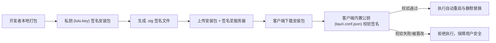

# 社团组队系统 (lulu) 在线自动更新与版本发布运维指南

> **文档版本**：v1.0.0  
> **适用技术栈**：Tauri v2 + Vue 3 + Vite + Windows NSIS  
> **最后更新**：2026-08-25  

---

## 目录
- [一、 核心更新机制与原理](#一-核心更新机制与原理)
- [二、 项目核心架构与文件职责](#二-项目核心架构与文件职责)
- [三、 第一次发布：构建 v3.3.0 种子基准版本](#三-第一次发布构建-v330-种子基准版本)
- [四、 后续发布：从 v3.3.0 推送新版更新（完整实操）](#四-后续发布从-v330-推送新版更新完整实操)
- [五、 线上分发服务器配置与托管方案](#五-线上分发服务器配置与托管方案)
- [六、 常见问题与避坑指南 (FAQ)](#六-常见问题与避坑指南-faq)

---

## 一、 核心更新机制与原理

### 1. 什么是“种子版本 / 基准版本”？
- **原理**：只有安装了具备“更新能力（Updater 插件 + 嵌入公钥 + 权限）”的客户端，才能在启动时自动向远程服务器查询更新信号。
- **历史旧版本（如 0.1.0、1.0.0）**：由于当时尚未集成更新插件，它们不会主动向服务器发送请求，因此**无法接收任何在线更新推送**。
- **从当前 v3.3.0 开始**：已完整植入更新引擎与公钥。用户只要安装了 `v3.3.0`，之后所有版本（v3.4.0、v3.5.0...）都将**全自动在线静默检测、下载并覆盖安装**。

### 2. Ed25519 非对称加密签名防篡改


---

## 二、 项目核心架构与文件职责

| 文件路径 | 职责说明 |
| :--- | :--- |
| `src-tauri/lulu.key` | **签名私钥**（绝密！用于打包时签名，已加入 `.gitignore`） |
| `src-tauri/tauri.conf.json` | 配置更新服务端点（`endpoints`）、嵌入公钥（`pubkey`）及 NSIS 打包规则 |
| `src-tauri/capabilities/default.json` | 开通系统级权限：`updater` 检查下载、`process` 重启 |
| `src-tauri/src/lib.rs` | Rust 插件注册：`tauri_plugin_updater` 与 `tauri_plugin_process` |
| `src/composables/useUpdater.js` | Vue 3 组合式函数：响应式管理更新全生命周期与进度监听 |
| `src/components/AppUpdaterModal.vue` | 暗黑红调更新弹窗 UI：显示新版日志、动态流式进度条及重启按钮 |
| `scripts/generate-release.js` | 辅助脚本：一键根据当前版本生成 `latest.json` 线上清单模板 |

---

## 三、 第一次发布：构建 v3.3.0 种子基准版本

这是让用户迈入“自动更新体系”的第一步，必须生成一次完整的安装包分发给用户。

### 操作步骤：
1. 打开 PowerShell 终端，进入项目根目录：
   ```powershell
   # 设置签名私钥路径环境变量并执行打包
   $env:TAURI_SIGNING_PRIVATE_KEY_PATH = "src-tauri/lulu.key"
   npm run tauri build
   ```
2. 打包完成后，进入输出目录：
   ```text
   src-tauri/target/release/bundle/nsis/
   ```
3. 找到安装程序：
   ```text
   lulu_3.3.0_x64-setup.exe
   ```
4. **分发给用户安装**（或双击安装在自己电脑上作为测试基准客户端）。

---

## 四、 后续发布：从 v3.3.0 推送新版更新（完整实操）

当你在未来修改了代码，需要发布新版本（例如 **v3.4.0**）时，执行以下 4 步即可：

### 步骤 1：修改版本号（从 3.3.0 升级为 3.4.0）
同步修改以下 3 个文件中的版本号为 `3.4.0`：
- `package.json` -> `"version": "3.4.0"`
- `src-tauri/Cargo.toml` -> `version = "3.4.0"`
- `src-tauri/tauri.conf.json` -> `"version": "3.4.0"`

### 步骤 2：执行正式打包与数字签名
```powershell
$env:TAURI_SIGNING_PRIVATE_KEY_PATH = "src-tauri/lulu.key"
npm run tauri build
```
打包成功后，在 `src-tauri/target/release/bundle/nsis/` 会生成：
- `lulu_3.4.0_x64-setup.nsis.zip`（**更新包本体**）
- `lulu_3.4.0_x64-setup.nsis.zip.sig`（**数字签名文件**）

### 步骤 3：生成并填写线上 `latest.json`
1. 运行一键模板生成命令：
   ```bash
   npm run release:template
   ```
2. 打开根目录下生成的 `latest.template.json`（重命名为 `latest.json`）：
   ```json
   {
     "version": "3.4.0",
     "notes": "1. 修复了组队系统的若干交互体验；\n2. 优化了暗黑主题弹窗与过渡动效；\n3. 提升了数据同步稳定性。",
     "pub_date": "2026-08-25T12:00:00Z",
     "platforms": {
       "windows-x86_64": {
         "signature": "【把 lulu_3.4.0_x64-setup.nsis.zip.sig 文件内的文本原样复制粘贴到这里】",
         "url": "https://your-domain.com/updates/lulu_3.4.0_x64-setup.nsis.zip"
       }
     }
   }
   ```

### 步骤 4：上传到线上服务器
将 `latest.json` 和 `lulu_3.4.0_x64-setup.nsis.zip` 上传到你的分发服务器即可！

---

## 五、 线上分发服务器配置与托管方案

### 方案 A：GitHub Releases 托管（完全免费，0成本首选）
1. 在 GitHub 仓库中点击 **Create a new release**。
2. Tag 选择或新建 `v3.4.0`，Title 填写 `Release v3.4.0`。
3. 将 `lulu_3.4.0_x64-setup.nsis.zip` 和 `latest.json` 作为附件拖拽上传并点击 **Publish release**。
4. `tauri.conf.json` 中的 endpoints 填写：
   ```json
   "endpoints": [
     "https://github.com/你的用户名/你的仓库名/releases/latest/download/latest.json"
   ]
   ```

### 方案 B：阿里云 OSS / 腾讯云 COS / 七牛云（国内极速推荐）
1. 创建一个公共读存储桶（Bucket），如 `my-app-releases`。
2. 开启 CDN 加速并绑定自定义域名（如 `https://update.yourdomain.com`）。
3. 每次发布将 `latest.json` 和 `.nsis.zip` 上传到根目录或 `updates/` 目录下。
4. `tauri.conf.json` 中的 endpoints 填写：
   ```json
   "endpoints": [
     "https://update.yourdomain.com/updates/latest.json"
   ]
   ```

### 方案 C：自建 Nginx 服务器
Nginx 配置示例：
```nginx
server {
    listen 443 ssl;
    server_name update.yourdomain.com;

    ssl_certificate /etc/nginx/ssl/fullchain.pem;
    ssl_certificate_key /etc/nginx/ssl/privkey.pem;

    root /var/www/app-updates;

    # 关键：latest.json 严禁缓存，确保客户端每次拉取最新版本号
    location = /latest.json {
        add_header Cache-Control "no-cache, no-store, must-revalidate";
        add_header Access-Control-Allow-Origin *;
    }

    # zip 压缩包允许长期缓存以节省流量
    location ~* \.(zip|sig)$ {
        expires 30d;
        add_header Access-Control-Allow-Origin *;
    }
}
```

---

## 六、 常见问题与避坑指南 (FAQ)

### Q1: 客户端启动后没有弹出更新弹窗？
1. **版本号检查**：线上 `latest.json` 中的 `version` 必须**严格大于**本地客户端的版本号（例如 `3.4.0` > `3.3.0`）。
2. **端点 URL 可访问性**：在浏览器中直接打开 `endpoints` 的 URL，检查能否正常返回正确的 JSON 文本。
3. **CDN 缓存问题**：确保分发服务器没有将旧版 `latest.json` 强缓存。

### Q2: 提示“Signature verification failed / 签名校验失败”？
- 原因：填入 `latest.json` 的 `signature` 与安装包不匹配，或者公私钥不一致。
- 解决：确保签名是从本次构建生成的 `.nsis.zip.sig` 中直接复制的完整字符串。

### Q3: 私钥文件 `src-tauri/lulu.key` 丢失了怎么办？
- ⚠️ **高危警告**：如果私钥丢失，已分发给用户的旧客户端将无法校验新版本的签名，导致无法自动更新。
- **备份建议**：请将 `src-tauri/lulu.key` 妥善保存在安全的私密位置（如个人加密 U 盘或密码管理器）。
